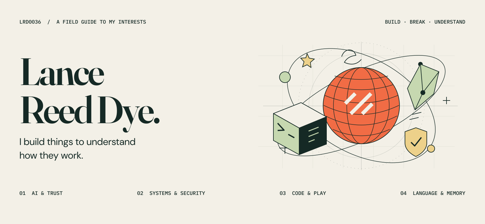

<picture>
  <source media="(prefers-color-scheme: dark)" srcset="assets/cover-dark.svg">
  <source media="(prefers-color-scheme: light)" srcset="assets/cover-light.svg">
  
</picture>

I'm Lance. If you don't already know me, nice to meet you! Otherwise, my condolences.

I'm in the midst of an AI transformation project. I also do AI security, responsible AI implementation, and whatever else I feel like doing that month.

I don't like AWS. Mainly gravitate towards Cloudflare/GCP as of right now. 

### What keeps my attention

- **AI & trust** — Agent behavior, local models, human judgment, and the boundaries between interpretation, authority, and action.
- **Systems & security** — Reverse engineering, SecOT, Critical Infrastructure, and the ways software decisions become real-world consequences.
- **Code & play** — Rust, simulations, games, procedural graphics, and interactive experiments that make an idea tangible.
- **Language & memory** — Writing, archives, cultural memory, and what gets lost when information survives without its original context.

### A few places to start

| Project | What I'm exploring |
| :--- | :--- |
| [Runbook Compiler](https://github.com/Lrd0036/google) | Turning human procedures into bounded, verifiable workflows, with explicit limits on what a model can decide. |
| [Royal Duke](https://github.com/Lrd0036/SCLC) | A fictional cyber-physical scenario told through an interactive documentary and an optional local process simulation. |
| [CJIS Security Policy Field Guide](https://github.com/Lrd0036/cjis-secpol-guide) | Making security requirements, evidence, and decision authority easier to reason about. An unofficial educational guide. |
| [TaxpayerROI](https://github.com/Lrd0036/taxpayer-roi) | Public data, county-level analytics, and questions about fiscal outcomes and equity. |
| [Timberhold](https://github.com/Lrd0036/timberhold-site) | The public site for a cozy lumber RPG: trees, sawmills, and a little world to build. |
| [Boguefala](https://boguefala.us) | An interactive archive of systems, language, memory, and provenance. |

Experiment first, figure out the security later! (So sorry to my GRC peoples).

Cover and original vector artwork created in Figma. [Design source and exports](design/README.md).
